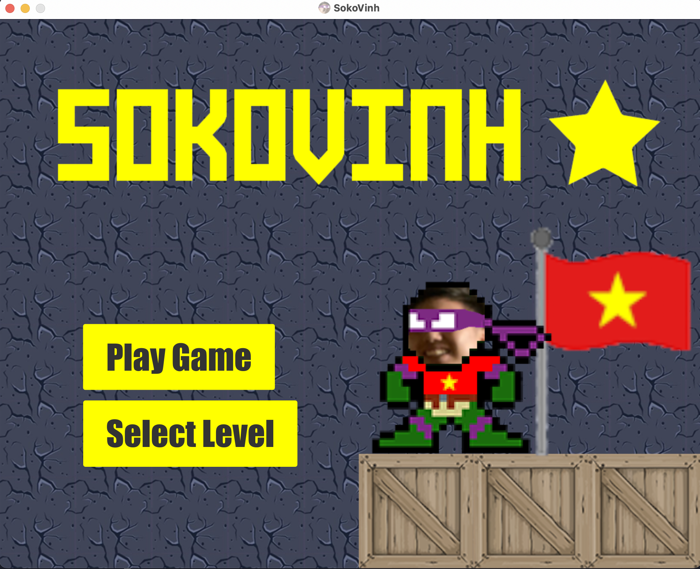
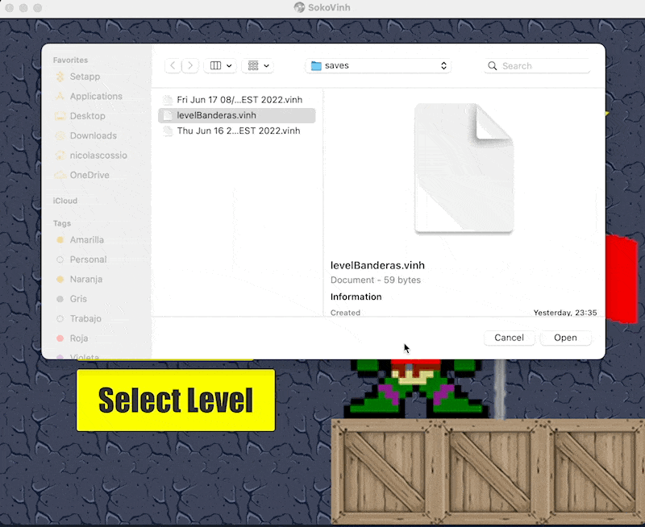
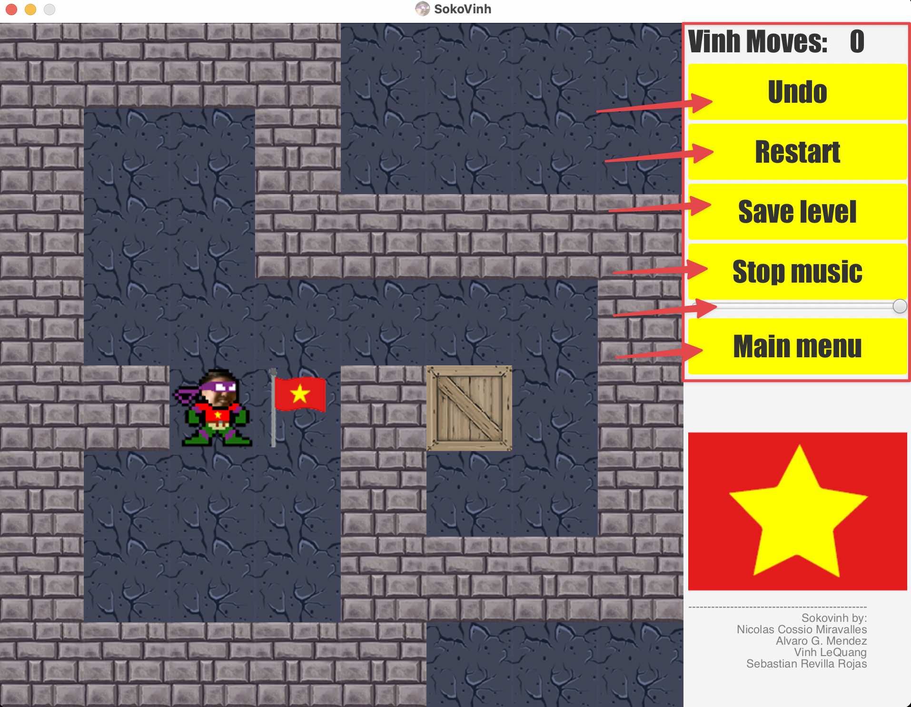
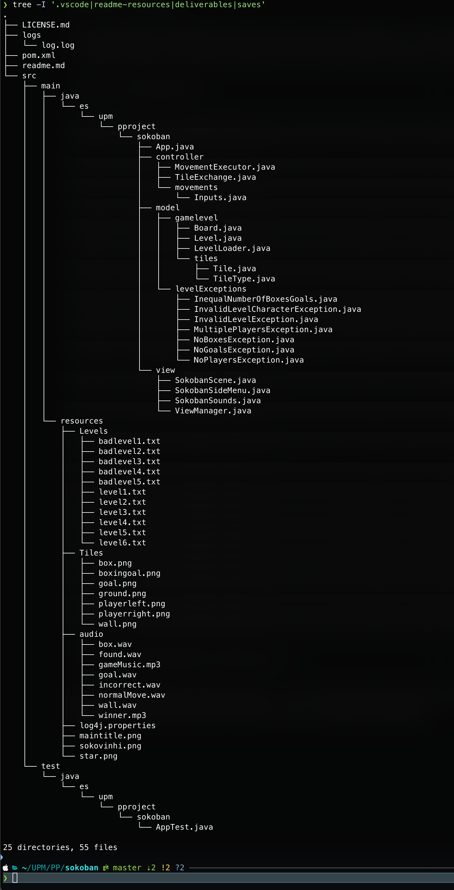

# Sokovinh™️®️ - A Sokoban like game with a little of 🇻🇳

Sokovinh™️®️ is a game based on the Sokoban game. The main character Vinh wakes up in weird place filled with boxes and weird flags, he's confused but remembers that he has to find his way back to the village.

He discovers that he has gained amazing strength and can move this freaking huge boxes around. He starts moving them around and places one of them in one of those places with a flag, then a weird sound starts to play and he suddenly teleports to another place with even more boxes and hallways.

He doesn't know what's going on, but the sooner he finds his way back to the village, the better. So moving this boxes to the flags as quick as possible might help him find a way to exit this place. Thing is, he starts to feel tired after moving a bunch of boxes, so the least movements done the better.

> Sokovinh is a registered trademark of [the Sokovinh team](https://sokovinh.com) and is licensed under the [MIT license](LICENSE.md).

## How to run the game

You must have Java 11 installed with Maven, clone the repo, do `mvn clean install` and then run the game with `mvn clean javafx:run`. The main menu should appear.

> We must say that our plan was to release an executable jar file, but we didn't have time to do it, plus packaging a Java application is not as trivial as it seems. Sorry for the inconvenience.

## Main menu

You will be greeted by perhaps one of the most amazing menus there has been in a videogame:

The select level button will display a popup dialog where we can choose our own custom level or select a saved level.

## Gameplay

### Controls

- Arrow keys to move the character
- Mouse to click on menu items and buttons
- If at any point a dialog box shows up you can just close the window and it will dissapear

### Game objective

The main objective of the game is to move the boxes to the flags in as little moves as possible. In order to move a box you must get on the a tile next to it and move towards the box in the direction you want to move it.

Example:

### How to win

Move all boxes to the flags. Once you do so a winner screen will show up showing you the amount of moves accumulated in all the levels played in this game session. You can also save your progress and load it later.

Example:

### Side menu buttons
There are 6 buttons available in the side menu:

- Undo
- Restart
- Save level
- Stop music
- Volume slider
- Main menu

#### Undo

Clicking on this button will undo the last move.
Example of undo:

#### Restart

Clicking on this button will restart this level. Be careful, this will delete all your progress.
Example of restart:

#### Save level

Clicking on this button will save this games progress. You can then load it in the main menu screen, and you will have your progress saved.

Example:

#### Stop/Play music and volume slider

We know sometimes you just want to play Sokovinh with no distractions, that's why we have music on/off button. Clicking on this button will toggle the music on or off.

We also have a volume slider that will change the volume of the music.

#### Main menu

Clicking on this button will return you to the main menu. But first a dialog with three options will appear:

## Project structure

We followed the popular MVC design pattern for this project. The directory structure looks like the following:

## Credits

- Nicolas Cossio Miravalles
- Vinh Le Quang
- Sebastian Revilla
- Alvaro Gonzalez Mendez
  
